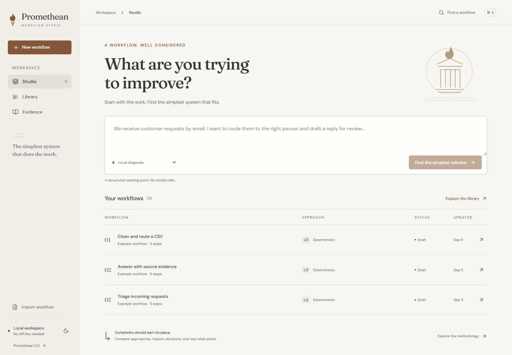
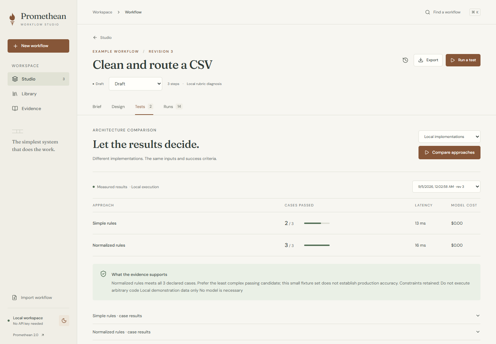
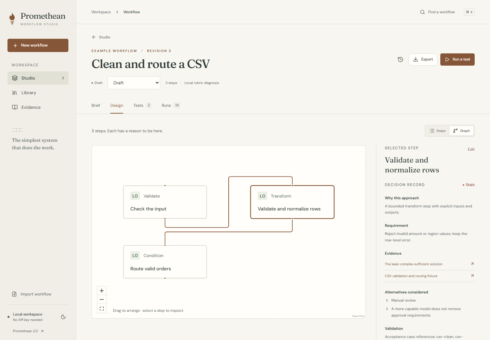
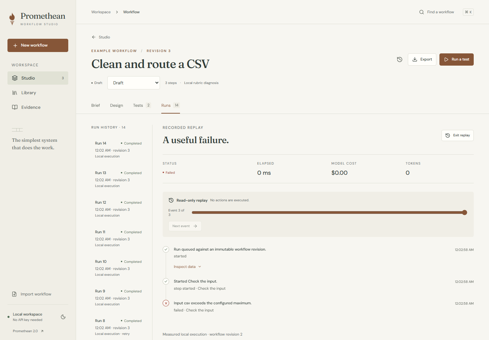
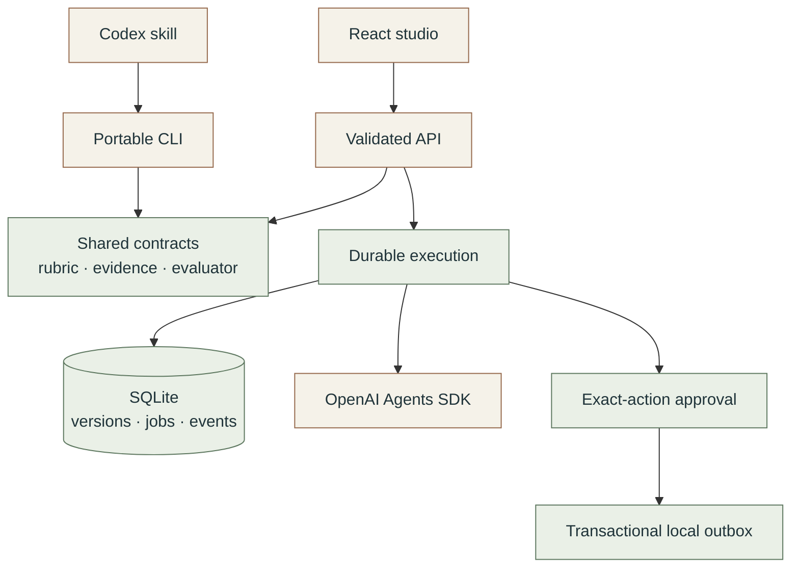

<p align="center">
  
</p>

<p align="center">
  <a href="https://github.com/RedLynx101/Promethean/actions/workflows/ci.yml"></a>
  
  
  
  <a href="LICENSE"></a>
</p>

<p align="center">
  <a href="#try-it-locally">Try it</a> ·
  <a href="docs/showcase.md">Product tour</a> ·
  <a href="#inside-the-system">Architecture</a> ·
  <a href="docs/verification.md">Evaluation evidence</a> ·
  <a href="docs/skill.md">Codex skill</a>
</p>

Promethean is a workflow studio for individuals and small teams deciding what to automate and how much AI the work actually needs. Start with the process, compare working implementations against the same cases, and inspect the evidence behind each decision. Sometimes the right answer is a clearer procedure or a short script.

**Diagnose → Compare → Build → Prove**

The interface brings together a decision brief, an inspectable workflow graph, an architecture comparison lab and durable execution traces. A shared TypeScript core powers both the studio and a repository-scoped Codex skill.

<a href="docs/showcase.md"></a>

## Three ways to inspect the work

### Compare approaches on evidence

Run genuinely different implementations against identical inputs and acceptance criteria. See correctness, latency, model tokens and calculated cost together. A simpler candidate must pass the same cases before Promethean recommends it; when none qualifies, that failure stays visible.



### Understand a decision. Revisit a failure.

Select a step to inspect its requirement, evidence, alternatives, rubric and test references. Every revision preserves its earlier decisions. Replay a recorded failure without repeating effects, review a correction, then retry against a new revision with ordinary approval controls.

<table>
  <tr>
    <td width="50%"><a href="docs/screenshots/workflow-design.png"></a></td>
    <td width="50%"><a href="docs/screenshots/workflow-replay.png"></a></td>
  </tr>
  <tr>
    <td><strong>Decision provenance</strong><br>Requirements and rationale stay attached to the design.</td>
    <td><strong>Failure replay & portable export</strong><br>Keep the original trace; share a validated workflow package.</td>
  </tr>
</table>

[Explore light, dark and mobile views →](docs/showcase.md)

## Try it locally

Install **Node.js 24** and **pnpm 10**, then:

```sh
git clone https://github.com/RedLynx101/Promethean.git
cd Promethean
pnpm install --frozen-lockfile
pnpm demo
```

Open **http://127.0.0.1:4317**. The prepared demo executes local algorithms to create comparisons, a failed/corrected CSV run and a denied triage action. It needs no API key or database service. Restarting preserves the recorded work.

Begin with **Clean and route a CSV → Tests**. Strict parsing fails a formatting variant; normalization passes. Move to **Design** for the reasoning and **Runs** for the failure and correction. The [walkthrough](docs/walkthrough.md) covers the full journey.

| Included workflow          | What it demonstrates                                                           |
| -------------------------- | ------------------------------------------------------------------------------ |
| CSV validation and routing | Data normalization can solve the problem without AI.                           |
| Incoming request triage    | Compare rules with semantic classification; surface missing taxonomy coverage. |
| Source-grounded support    | Retrieve evidence, cite it, and refuse an unsupported answer.                  |

Use `pnpm dev` for a separate working studio. Data stays under `work/data/`; the prepared demo uses `work/demo/`. The API listens on port 4318.

<details>
<summary><strong>Enable live model workflows</strong></summary>

Provide `OPENAI_API_KEY` or `OPENAI_API_KEY_FILE` only to the server process. For PowerShell:

```powershell
$env:OPENAI_API_KEY_FILE = 'C:\path\to\your-private-key.txt'
$env:PROMETHEAN_MODEL = 'gpt-5.6-luna'
pnpm dev
```

The installed model choices are Luna and Terra. Conservative reservations, bounded inputs/outputs/turns and a durable per-workspace cost ledger constrain calls. Unknown provider outcomes retain their reservations. A local allowance is not an account billing limit. SDK tracing export and response storage are disabled; explicit live mode still sends workflow text to OpenAI.

See [.env.example](.env.example) for settings. Environment files are not automatically loaded. Paid evaluation is opt-in and excluded from ordinary CI. The demo command always runs without model credentials.

</details>

## What the evaluations show

On eight independently authored, frozen synthetic cases, semantic classification helped triage while keyword retrieval remained sufficient for support. Implementations and prompts were not tuned to those answers.

| Held-out cases          | Simple baseline | Expanded rules / keyword retrieval | Luna workflow |
| ----------------------- | --------------- | ---------------------------------- | ------------- |
| Request triage          | 1 / 4           | 2 / 4                              | 4 / 4         |
| Source-grounded support | 3 / 4           | 4 / 4                              | 4 / 4         |

These small samples support specific design decisions, not production accuracy claims. The [verification record](docs/verification.md) includes exact cases, outputs, timings, usage, cost calculations and limitations. It also records **56 passing regression tests**, **three browser journeys**, real SDK calls, independent review and focused accessibility checks.

## Inside the system



The important boundaries live in code: Zod schemas validate transport and model output; immutable revisions prevent stale edits from overwriting current work; graph validation rejects unsupported operations and approval bypasses. SQLite persists jobs, completed steps, approvals and cost reservations across requests and restarts. Canvas positions cannot change executable meaning.

[Architecture decisions](docs/architecture/decisions.md) · [Canonical rubric](docs/architecture/canonical-rubric.md) · [Engineering case study](docs/case-studies/redesign.md)

<details>
<summary><strong>Repository map</strong></summary>

| Path                         | Responsibility                                                |
| ---------------------------- | ------------------------------------------------------------- |
| `apps/web`                   | Responsive React/Vite studio and React Flow inspection        |
| `apps/api`                   | Validated HTTP transport and local access boundary            |
| `packages/core`              | Contracts, rubric, evidence, operations and package integrity |
| `packages/agents`            | SDK diagnosis, classification, retrieval and drafting         |
| `packages/runtime`           | Durable jobs, versions, approvals, comparisons and usage      |
| `packages/cli`               | Portable workflow commands, shared with Codex                 |
| `.agents/skills/promethean`  | Repository-scoped diagnostic skill                            |
| `examples`, `evals`, `tests` | Portable packages, measured cases and regression coverage     |
| `docs`                       | Product tour, engineering decisions, history and verification |
| `archive/alpha`              | Original course source, reports, traces and media             |

</details>

## Use Promethean in Codex

Open this repository in Codex and invoke `$promethean` or select it in `/skills`:

```text
$promethean Diagnose our intake workflow. Compare a manual procedure,
a deterministic script, and an AI workflow. Find the minimum viable
solution and define the cases that would prove it works.
```

The skill uses the same rubric, evidence catalog and portable CLI as the app. It can reason about broader processes and propose extensions; the runtime still validates which operations actually exist. Native `/promethean` routing depends on the Codex host. [Skill guide](docs/skill.md) · [Workflow package format](docs/workflow-packages.md).

## Development

```sh
pnpm typecheck
pnpm lint
pnpm test
pnpm build
pnpm exec playwright install chromium
pnpm test:browser
pnpm format:check
```

CI verifies contracts on Linux and Windows and browser journeys on Linux. [Contributing](CONTRIBUTING.md) explains the development workflow. `pnpm start` runs the API alone; `pnpm dev` runs the local studio.

## Current scope

Promethean runs in one local workspace with three installed recipes and a restricted operation catalog. Unknown processes receive a clarification brief. Retrieval uses a small synthetic corpus, and the only effect adapter is a **local outbox**. No email is sent. Arbitrary workflow compilation, corporate ingestion, external connectors and hosted team identity remain future work. Node 24's SQLite API emits an experimental warning. [Security boundary](SECURITY.md) · [Roadmap](docs/roadmap.md).

## Project history & attribution

Created from the Agentic Systems Studio project led by **[Noah Hicks](https://github.com/RedLynx101)** with **Rushabh Kankariya**, **Vishnu Bala**, **Yiying Lu** and **Mel Wong**. This v2 redesign is Noah's subsequent development with Codex assistance; original team work and Git history are preserved. [Project history](docs/history/README.md) · [AI-use disclosure](AI_USAGE.md).

## License

Released under the [MIT License](LICENSE). Copyright © 2026 Noah Hicks and contributors. Third-party dependencies retain their own licenses.
