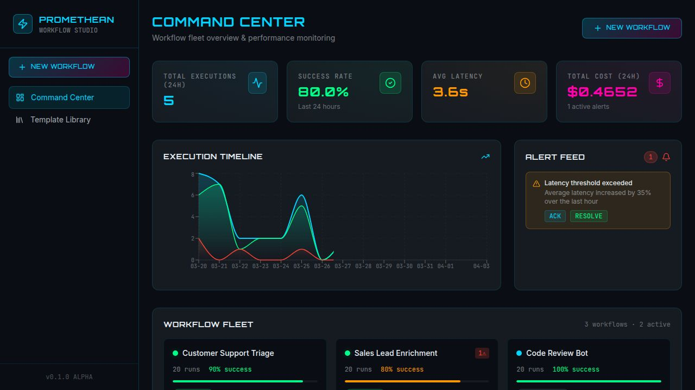
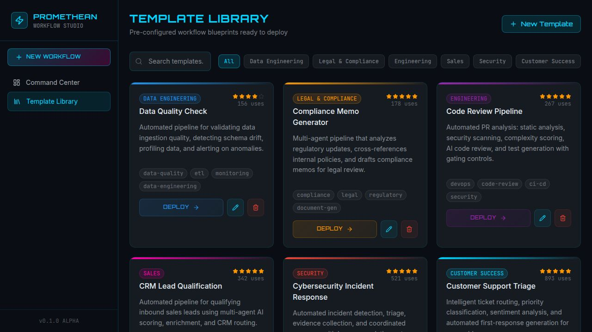
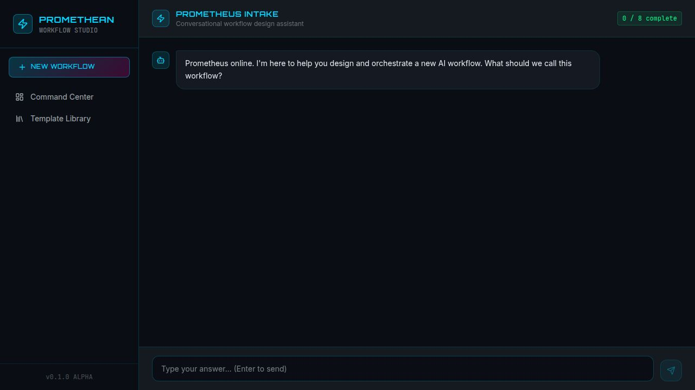

# Promethean Studio

**AI workflow orchestration studio — design in a visual editor with a four-agent pipeline and human approval gates, then click Build to emit real runnable code from a curated cookbook.**

Promethean takes a natural-language description of a business workflow, walks the user through four AI-assisted design phases in a visual editor (with a human approval gate at every stage), and — once the design is approved — emits **real executable code** (LangGraph / Inngest / Temporal / n8n / Claude Agent SDK / plain script) generated from a curated knowledge vault.



---

## Team

**Track A: Technical Build** | Agentic Systems Studio — Phase 2 / Phase 3

| Name | Role |
|------|------|
| Noah Hicks | Project Lead |
| Rushabh Kankariya | Tech Stack Testing/Exploration |
| Vishnu Bala | Agent Alignment |
| Yiying Lu | Tech Stack Testing/Exploration |
| Mel Wong | Project Alignment |

---

## How it works — end to end

```
┌──────────────────────────────────────────────────────────────┐
│  1. DESIGN — in the Promethean UI                            │
│                                                              │
│  Wizard (plain-English brief)                                │
│      ↓                                                       │
│  Decomposition agent  → React Flow editor → [Approve]        │
│      ↓                                                       │
│  System Selection     → editor → [Approve]                   │
│      ↓                                                       │
│  Orchestration        → editor → [Approve]                   │
│      ↓                                                       │
│  Governance           → editor → [Approve]                   │
│      ↓                                                       │
│  Approved workflow JSON persisted in Postgres                │
└──────────────────────────────────────────────────────────────┘
                            ↓
                      [ Build button ]
                            ↓
┌──────────────────────────────────────────────────────────────┐
│  2. BUILD — emit phase (the cookbook kicks in)               │
│                                                              │
│  POST /api/workflows/:id/emit { targetFramework }            │
│      ↓                                                       │
│  Manifest written to emit-requests/<id>.json                 │
│      ↓                                                       │
│  Harness (Claude Code / Codex / MS Agent Factory) picks it   │
│  up, loads skills/emit.md, reads vault/ via MCP              │
│      ↓                                                       │
│  out/<workflow-slug>/  — real runnable code + tests + README │
└──────────────────────────────────────────────────────────────┘
```

**Design** happens in the UI you already know — Wizard, visual editor, four specialized agents, approval gates. Nothing about that changes.

**Build** is the new thing: an emit phase that translates the approved JSON into real code by reading a curated cookbook — `vault/integrations/` for per-tool auth/idempotency/rate-limits, `vault/patterns/` for edge-type semantics, `vault/governance/` for the cost/latency/timeout middleware. This is what makes "deployable" actually mean deployable.

See [`PIVOT.md`](PIVOT.md) for the architectural rationale and [`skills/emit.md`](skills/emit.md) for the emit skill's full contract.

---

## Screenshots

| Command Center | Template Library | Workflow Wizard |
|:-:|:-:|:-:|
|  |  |  |

---

## Architecture

```
promethean/
├── artifacts/
│   ├── promethean/          React + Vite frontend (SPA) — Wizard, editor, approvals, Build button
│   ├── api-server/          Express 5 API — four in-process design agents + POST /workflows/:id/emit
│   └── mcp-vault/           MCP stdio server exposing the vault to harnessed agents
├── vault/                   Curated markdown cookbook (Obsidian-compatible)
│   ├── integrations/        Per-tool auth, idempotency, rate limits (primary emit-time context)
│   ├── patterns/            parallel / conditional / error / retry / human-gate (primary emit-time context)
│   ├── governance/          cost / latency / logging / snapshots / alerting / timeouts (emit middleware spec)
│   ├── spectrum/            L0–L5 doctrine (human reference; agent prompts derive from this)
│   └── templates/           6 reference workflow blueprints (human reference)
├── skills/
│   ├── emit.md              ← the canonical pivot skill (turns approved JSON into code)
│   └── archive/             ← alternative headless entry points (not canonical path)
├── emit-requests/           Queue of pending build jobs (written by API, consumed by harness)
├── lib/
│   ├── db/                  PostgreSQL schema (Drizzle ORM)
│   ├── api-spec/            OpenAPI 3.1 specification
│   ├── api-zod/             Generated Zod validation schemas
│   └── api-client-react/    Generated React Query hooks (Orval)
├── .mcp.json                ← wires Claude Code to the vault MCP server
├── PIVOT.md                 ← architectural rationale + wiring guide
└── screenshots/
```

### Frontend — the design surface

React 19 single-page app built with Vite, styled with Tailwind v4 and a custom sci-fi dark theme inspired by [ARWES](https://arwes.dev). Key libraries:

- **React Flow** (`@xyflow/react`) — interactive node-graph editor with custom color-coded nodes per system level
- **Recharts** — execution timeline charts and performance metrics
- **Radix UI + Park UI** — accessible component primitives
- **Orbitron + JetBrains Mono** — display and monospace typefaces

Pages: Command Center (dashboard), Workflow Wizard (chat-style intake), Visual Editor (React Flow canvas), Template Library, Workflow Detail.

### Backend — design agents + emit

Express 5 REST API with structured logging (pino), Zod request validation, and four specialized AI agents that run the design pipeline in-process:

| Agent | Responsibility |
|-------|---------------|
| **Decomposition** | Breaks natural-language descriptions into atomic workflow nodes |
| **System Selection** | Classifies each node on the L0-L5 autonomy spectrum |
| **Orchestration** | Adds edge routing, error handling, parallel paths, and tool integrations |
| **Governance** | Configures monitoring, alerting thresholds, cost/latency guardrails |

All four are triggered by `POST /api/pipeline/*`, run OpenAI structured-outputs with Zod-validated schemas, and persist to Postgres. This is the existing Promethean pipeline — unchanged by the pivot.

**New endpoint:** `POST /api/workflows/:id/emit { targetFramework }` — writes an emit-request manifest to `emit-requests/` after all four design phases are approved. A harness worker picks up the manifest and runs `skills/emit.md` against the vault to produce code in `out/<workflow-slug>/`.

> **Heads-up on executions.** `POST /executions` in the API server is a simulation — it writes plausible cost/latency rows for UI demos, it does not actually run node graphs. Real execution happens in the emitted code (see `out/<workflow>/`), not here. The simulated endpoint is kept for Command Center UI continuity and flagged in-source.

### Database

PostgreSQL with Drizzle ORM. Six core tables:

- `workflows` — workflow definitions with JSONB node/edge graphs and governance configs
- `workflow_versions` — immutable snapshots at each phase transition
- `templates` — pre-built workflow blueprints (6 seed templates; also mirrored as narrative notes under `vault/templates/`)
- `executions` — simulated run records (see note above)
- `execution_steps` — per-node execution telemetry (simulated)
- `alerts` — governance-triggered alerts with acknowledge/resolve lifecycle

### Vault — the cookbook

Curated markdown notes, Obsidian-compatible, agent-consumable via MCP. See [`vault/README.md`](vault/README.md) for the folder layout and role each folder plays at emit time.

- `integrations/` — **primary emit context.** Per-tool auth, idempotency, rate limits, structured-output schemas.
- `patterns/` — **primary emit context.** Edge-type semantics and error-handling strategies.
- `governance/` — emit-time middleware spec (cost cap, latency threshold, timeout, alerting). Also human reference doctrine.
- `spectrum/` — human reference doctrine for the six levels. The in-process agents' system prompts derive from this.
- `templates/` — reference workflow blueprints. Humans consult when starting a new workflow.

The vault grows organically as the team adopts new tools — add an integration note and every future emit gains the recipe.

### MCP vault server

`artifacts/mcp-vault/` is a minimal Model Context Protocol stdio server exposing the vault to any harnessed agent. Tools: `vault_list`, `vault_get`, `vault_search`, `spectrum_schema`, `vault_reload`. Wired to Claude Code via the project-root [`.mcp.json`](.mcp.json).

### API codegen pipeline

OpenAPI 3.1 spec → Orval generates React Query hooks and Zod validation schemas → consumed by the frontend with full type safety from database to UI.

---

## The Promethean System Spectrum

Every workflow node is classified on a six-level autonomy spectrum. **Always start at L0; justify every level increase.** The vault's `spectrum/` notes are the canonical reference; the table below is a summary.

| Level | Name | Color | Description |
|-------|------|-------|-------------|
| L0 | Deterministic | `#4CAF50` | Rule-based logic, no ML |
| L1 | Supervised ML | `#2196F3` | Traditional ML models with human oversight |
| L2 | Language Understanding | `#9C27B0` | NLP/NLU processing |
| L3 | Single LLM Agent | `#FF9800` | One LLM call with structured output |
| L4 | Tool-Augmented LLM | `#F44336` | LLM with external tool access |
| L5 | Multi-Agent | `#E91E63` | Coordinated multi-agent system |

Plus two special node types: **HumanGate** (manual approval checkpoints) and **Trigger** (workflow entry points).

---

## Tech Stack

| Layer | Technology |
|-------|-----------|
| Runtime | Node.js 24, TypeScript 5.9 |
| Monorepo | pnpm workspaces |
| Frontend | React 19, Vite 6, Tailwind v4, React Flow, Recharts |
| Backend | Express 5, pino (logging), Zod (validation) |
| Database | PostgreSQL, Drizzle ORM |
| Design-time AI | OpenAI GPT (structured outputs with Zod schemas) |
| Emit-time AI | MCP-aware coding harness: Claude Code, Codex, MS Agent Factory |
| Cookbook | Markdown + YAML frontmatter (Obsidian-compatible) |
| Bridge | `@modelcontextprotocol/sdk` stdio server |
| API Codegen | OpenAPI 3.1, Orval |
| Components | Radix UI, Park UI |

---

## Getting Started

### Prerequisites

- Node.js 24+
- pnpm 9+
- PostgreSQL database
- A Claude Code session (or other MCP-aware coding harness) for the emit phase — not needed for design-only demos

### Setup

Copy [`.env.example`](.env.example) to `.env` and set `DATABASE_URL` and OpenAI variables. Use two dev terminals for `PORT` (see inline comments in `.env.example` — the API and Vite both use the variable name `PORT`).

```bash
pnpm install

pnpm --filter @workspace/db run push

pnpm --filter @workspace/api-spec run codegen

pnpm --filter @workspace/mcp-vault run build
```

### Development

```bash
# Terminal 1: API server (design pipeline + emit endpoint)
pnpm --filter @workspace/api-server run dev

# Terminal 2: Frontend
pnpm --filter @workspace/promethean run dev
```

The API server runs on port 8080. The frontend dev server proxies `/api` requests to the backend automatically. The database seeds itself on first startup with sample workflows, templates, and execution data.

### Running an emit

1. Design a workflow through the UI (Wizard → four approval phases).
2. From the workflow detail page, click **Build** and pick a target framework.
3. The UI calls `POST /api/workflows/:id/emit`; a manifest lands in `emit-requests/`.
4. In another terminal:
   ```bash
   claude   # or your MCP-aware harness of choice, run from repo root
   ```
   Then paste:
   > *Read skills/emit.md and process `emit-requests/<filename>`. Generate code into the manifest's `targetDir`. Write EMIT_MANIFEST.json when done.*
5. Review the generated `out/<slug>/`, run its tests, ship.

(Until a file-watcher daemon is wired, step 4 is manual — see `emit-requests/README.md`.)

### Type Checking

```bash
pnpm run typecheck
```

---

## Design Philosophy

- **Design in the UI; deploy from the cookbook.** The Promethean UI is good at workflow design — humans iterating on graphs with visual diffs and feedback loops. The vault is good at codifying cross-cutting concerns — auth shapes, idempotency conventions, error strategies, governance middleware. The pivot puts each in the role it's best at: UI owns design, vault owns deploy.

- **Human-in-the-loop by default.** AI agents propose, humans approve. Every design phase has a gate where you can edit, reject with feedback, or approve the AI's output before moving forward. Emit is a separate human gate — you review the generated code before running it.

- **Typed end-to-end.** A single OpenAPI spec generates both the Zod schemas used by the backend and the React Query hooks consumed by the frontend. The vault's `spectrum_schema` MCP tool exposes the same contract to harnessed agents.

- **Separation of concerns.** Each design agent has one job. The emit skill has one job. The vault is one thing: a cookbook. Small, well-scoped pieces compose better than one monolith.

- **Don't build a runtime — rent one.** The pivot declines to build yet another durable workflow engine. The emitted artefact runs on LangGraph / Inngest / Temporal / n8n / etc. — all of which already solved durability, retries, tool use. Promethean's IP is the curated blueprint library + governance framework, not the runtime.

- **The vault is the product.** Emit quality is bounded by vault quality. When you adopt a new tool, add an integration note — every future emit inherits the recipe.

---

## Project Status

**v0.2.0 ALPHA — emit-phase pivot.** The canonical design loop (Wizard → four agents → approval gates → editor) is the existing production Promethean UI. The **new** emit phase adds real code generation: an endpoint, an emit-request queue, a curated vault, a skill file, and an MCP server that exposes the vault to any coding harness.

**What's demonstrably working:**
- The design pipeline (phases 1–4) runs end-to-end in the UI with human approvals. Unchanged by the pivot.
- `POST /api/workflows/:id/emit` accepts build requests, writes manifests to disk. Wired into `artifacts/api-server/src/routes/index.ts`.
- `@workspace/mcp-vault` MCP server passes full JSON-RPC smoke test — all five tools functional, all 43 vault notes load and resolve wikilinks correctly.
- Evidence of an external harness reading the vault and producing phase-1/phase-2 proposal outputs lives under [`phase-3/traces/exports/`](phase-3/traces/exports/) as secondary proof the vault is agent-consumable.

**Known gaps (honest section in [`PIVOT.md`](PIVOT.md)):**
- `POST /executions` is simulated — real execution happens in the emitted code in `out/`, not here. Simulated endpoint is flagged in-source.
- The emit skill has not yet been exercised against a target framework in a committed artefact. The commit wires the boundary; the first real emit is an immediate next step.
- No file-watcher daemon yet — the harness must be invoked manually from `emit-requests/`. Intentionally simple; a daemon is easy to add when the manual loop feels stable.

**Phase 3 (final) documentation** lives under [`phase-3/`](phase-3/README.md), including the harness-path evidence bundle at [`phase-3/traces/exports/h_pivot_github-triage_20260422_SUMMARY.md`](phase-3/traces/exports/h_pivot_github-triage_20260422_SUMMARY.md).

---

*Built with TypeScript, React, Express, PostgreSQL, OpenAI, Anthropic's Claude Agent SDK, and the Model Context Protocol.*
