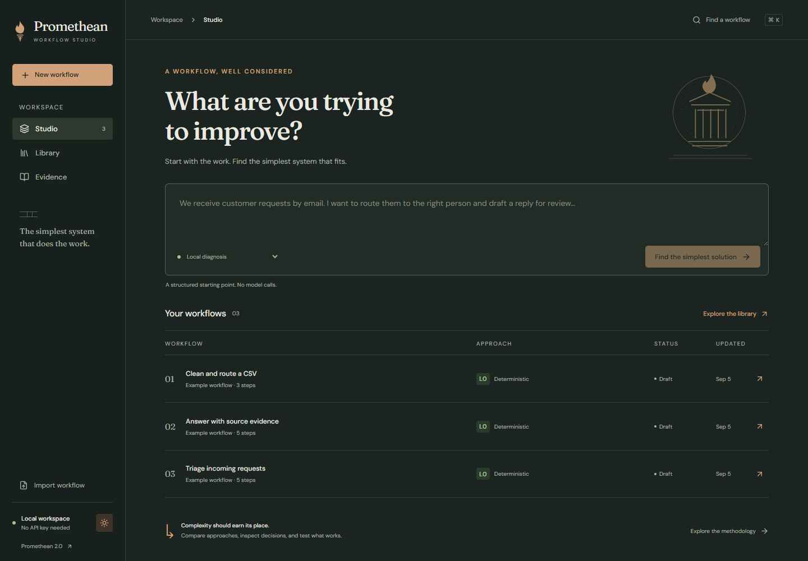
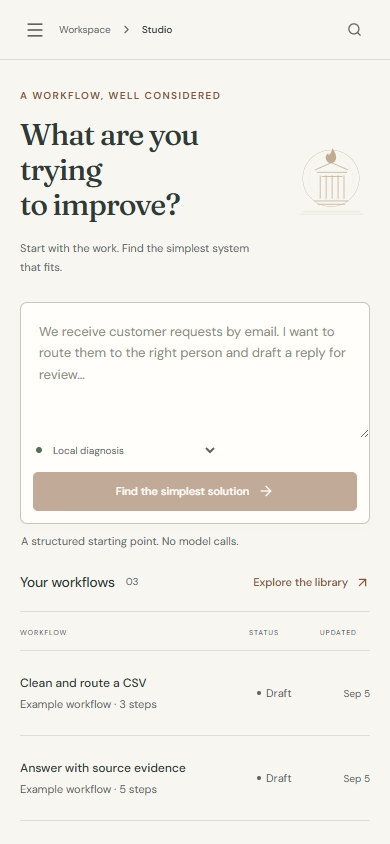

# A workflow, well considered

[← Promethean](../README.md) · [Run the demo](../README.md#try-it-locally) · [Step-by-step walkthrough](walkthrough.md)

Promethean's Greco-modern studio puts a decision brief before a graph. Limestone surfaces, ink typography and bronze controls give the work a quiet visual identity; the operating information stays concrete.

## Start with the process

Describe what happens today. Review a recommendation, constraints and missing information before deciding what to build. The no-key demo includes three bounded workflow recipes, so you can inspect actual behavior immediately.

## Let the results decide

The CSV example compares strict parsing and normalization on the same three cases. Two different algorithms produce two different outcomes. Neither makes a model call. Each result retains its input, evaluator and workflow revision.

## Inspect why a step exists

The graph and step list share the same design record: requirement, supporting evidence, alternatives and acceptance references. A stale marker keeps an earlier rationale from masquerading as current proof after an edit. The screenshot shows that state deliberately on the corrected demo revision.

## Keep the failure. Change the next run.

The prepared demo contains an actual rejected input at revision 2 and a successful correction at revision 3. Read-only replay steps through the earlier events. It does not execute the workflow or send an action again. Export produces a validated data package containing the specification, eligible cases, provenance and runbook.

## Work in light, dark or a smaller window

The obsidian theme uses the same information hierarchy. On a phone, intake and the step list remain available; navigation opens only when needed. The application honors reduced-motion preferences and provides keyboard focus, native dialogs and non-color status labels.

<table>
  <tr>
    <td width="72%"></td>
    <td width="28%"></td>
  </tr>
</table>

## Reproduce these screens

These are unretouched captures of the running app with synthetic demo data. The README masthead is a separately labeled [AI-generated brand illustration](brand/README.md).

Start `pnpm demo` in one terminal. In another, with Playwright's Chromium installed, run `pnpm capture:showcase`. On Windows this capture can use installed Chrome with `PROMETHEAN_BROWSER_CHANNEL=chrome`. It uses a separate browser profile and only reads workflow data. The script refuses a workspace that does not contain the expected three examples.

Browser tests write their evidence under `test-results/captures/`, so ordinary verification cannot overwrite the curated repository screenshots. [Verification record](verification.md) describes coverage and limits.
