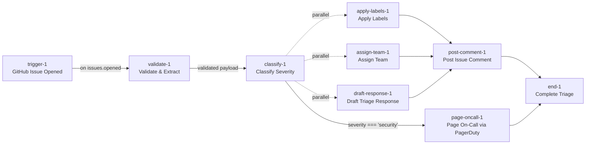

# Decomposition Proposal

**Brief:** "When a new GitHub issue is opened on our repo, classify its severity (bug / feature-request / question / security), draft a short triage response in the issue's voice, and page on-call via PagerDuty only for security issues. Add the right labels and assign to the right team."

**Domain:** Engineering
**Constraint:** budget cap $0.50/run

**Closest prior art:** [[vault/templates/template-customer-support-triage]] — same "classify → auto-respond → route" shape on an inbound ticket. Also borrows the GitHub trigger contract from [[vault/templates/template-code-review-pipeline]] and the conditional-paging pattern from [[vault/templates/template-cybersecurity-incident-response]] (`severity === 'security'` → PagerDuty).

## Proposed graph



## Nodes

| ID | Label | Description |
|----|-------|-------------|
| trigger-1 | GitHub Issue Opened | Webhook receiver for `issues.opened`; validates `X-Hub-Signature-256` HMAC and stores `X-GitHub-Delivery` as idempotency key. |
| validate-1 | Validate & Extract | Deterministic extraction of `{title, body, author, repo, labels}` from webhook payload; rejects malformed events. |
| classify-1 | Classify Severity | LLM classification of issue into one of `{bug, feature-request, question, security}` with confidence + rationale. |
| apply-labels-1 | Apply Labels | Deterministic map from classification → GitHub labels (`type:bug`, `type:feature`, `type:question`, `type:security`). |
| assign-team-1 | Assign Team | Deterministic map from classification → team (`security-team` for security; `eng-triage` / `product` / `community` otherwise). |
| draft-response-1 | Draft Triage Response | Short triage reply in the issue's voice, tailored to severity (acknowledges report, sets expectation, links next steps). |
| page-oncall-1 | Page On-Call via PagerDuty | PagerDuty Events v2 trigger; fires **only** when `severity === 'security'`; `dedup_key = "{repo}-security-{issueNumber}"`. |
| post-comment-1 | Post Issue Comment | GitHub API post of the drafted triage response; idempotent via bot-comment lookup + PATCH. |
| end-1 | Complete Triage | Terminal result node; records execution outcome and labels-applied / team-assigned / paged flags. |

## Reasoning

The shape mirrors `template-customer-support-triage`: ingest → classify → fan-out to enrichment + action → join for the outbound reply. I fan out `apply-labels`, `assign-team`, and `draft-response` in parallel from `classify-1` because none of them depend on each other — labels and assignee are deterministic maps off the classification, and the draft only reads classification + issue text. They all converge on `post-comment-1` (which posts the drafted body once labels/assignee are in place, so the comment and the label/assignee arrive atomically from the author's perspective).

Paging is modelled as a conditional side-branch rather than a router: `classify-1 → page-oncall-1` takes `edge.type: "conditional"` with `condition: "severity === 'security'"`. This keeps `post-comment-1` from waiting on a branch that usually doesn't fire — the pager path terminates independently at `end-1`. Classification is the only step I'd argue warrants AI (L3); everything else is either a webhook contract, a deterministic map, or a templated API call, which is intentional because the $0.50/run cap is generous but not infinite.

One node shy of the canonical triage template — I dropped a separate "priority score" step because the four-way severity classification already carries enough signal for routing. Kept `validate-1` as its own node (rather than folding into the trigger) because GitHub webhook payloads need strict schema validation before the LLM sees them.

## Open questions for human

- **Draft tone:** "in the issue's voice" — do you mean *as the bot* but mirroring the reporter's tone (empathetic for frustrated users, crisp for terse bug reports), or literally ghost-writing the reporter's own follow-up? I assumed the former.
- **Security auto-labeling risk:** should `type:security` be applied automatically, or only after a human confirms (since security labels are often public and can tip off a reporter that something sensitive is in flight)? The current design auto-applies; consider inserting a HumanGate before `apply-labels-1` on the security branch.
- **PagerDuty routing key:** which service — `security` or a repo-specific one? `integration-pagerduty` recommends one service per domain so rotations stay clean.
- **Comment idempotency on replays:** if the same issue fires the webhook twice (GitHub retry), should we PATCH the existing bot comment or skip? Default here is PATCH via existing-comment lookup.
- **Confidence threshold:** classifier confidence `< 60` — should that flag for human review (per `spectrum-index` rule 7), or proceed with best-guess labels?

---

```json
{
  "nodes": [
    {
      "id": "trigger-1",
      "type": "custom",
      "position": { "x": 100, "y": 300 },
      "data": {
        "label": "GitHub Issue Opened",
        "description": "Webhook receiver for issues.opened events. Validates X-Hub-Signature-256 HMAC and stores X-GitHub-Delivery UUID as the execution idempotency key.",
        "status": "idle",
        "nodeCategory": "trigger",
        "tools": ["integration-github-api"]
      }
    },
    {
      "id": "validate-1",
      "type": "custom",
      "position": { "x": 350, "y": 300 },
      "data": {
        "label": "Validate & Extract",
        "description": "Deterministic extraction of { title, body, author, repo, issueNumber, existingLabels } from the webhook payload. Rejects malformed events before any LLM call.",
        "status": "idle"
      }
    },
    {
      "id": "classify-1",
      "type": "custom",
      "position": { "x": 600, "y": 300 },
      "data": {
        "label": "Classify Severity",
        "description": "Classify the issue into one of { bug, feature-request, question, security } with confidence (0-100) and a short rationale string.",
        "status": "idle"
      }
    },
    {
      "id": "apply-labels-1",
      "type": "custom",
      "position": { "x": 850, "y": 120 },
      "data": {
        "label": "Apply Labels",
        "description": "Deterministic map from severity classification to GitHub labels (type:bug | type:feature | type:question | type:security). Idempotent PUT on the issue's label set.",
        "status": "idle"
      }
    },
    {
      "id": "assign-team-1",
      "type": "custom",
      "position": { "x": 850, "y": 300 },
      "data": {
        "label": "Assign Team",
        "description": "Deterministic map from classification to GitHub team: security -> @org/security-team; bug -> @org/eng-triage; feature-request -> @org/product; question -> @org/community.",
        "status": "idle"
      }
    },
    {
      "id": "draft-response-1",
      "type": "custom",
      "position": { "x": 850, "y": 480 },
      "data": {
        "label": "Draft Triage Response",
        "description": "LLM drafts a short triage reply (<= 3 sentences) in the issue's voice: acknowledges the report, sets an expectation, and links the next step based on severity.",
        "status": "idle"
      }
    },
    {
      "id": "page-oncall-1",
      "type": "custom",
      "position": { "x": 850, "y": 660 },
      "data": {
        "label": "Page On-Call via PagerDuty",
        "description": "Fires PagerDuty Events API v2 trigger ONLY when severity === 'security'. dedup_key = '{repo}-security-{issueNumber}' so retries coalesce.",
        "status": "idle",
        "tools": ["integration-pagerduty"]
      }
    },
    {
      "id": "post-comment-1",
      "type": "custom",
      "position": { "x": 1100, "y": 300 },
      "data": {
        "label": "Post Issue Comment",
        "description": "Post the drafted triage reply via GitHub API. Looks up existing bot comments on the issue and PATCHes instead of POSTing to stay idempotent across webhook retries.",
        "status": "idle",
        "tools": ["integration-github-api"]
      }
    },
    {
      "id": "end-1",
      "type": "custom",
      "position": { "x": 1350, "y": 480 },
      "data": {
        "label": "Complete Triage",
        "description": "Terminal node. Emits execution result with flags: { labeled, assigned, drafted, commented, paged } for observability.",
        "status": "idle"
      }
    }
  ],
  "edges": [
    {
      "id": "e-trigger-validate",
      "source": "trigger-1",
      "target": "validate-1",
      "type": "default",
      "data": { "label": "on issues.opened", "condition": null }
    },
    {
      "id": "e-validate-classify",
      "source": "validate-1",
      "target": "classify-1",
      "type": "default",
      "data": { "label": "validated payload", "condition": null }
    },
    {
      "id": "e-classify-labels",
      "source": "classify-1",
      "target": "apply-labels-1",
      "type": "parallel",
      "data": { "label": "classification", "condition": null }
    },
    {
      "id": "e-classify-assign",
      "source": "classify-1",
      "target": "assign-team-1",
      "type": "parallel",
      "data": { "label": "classification", "condition": null }
    },
    {
      "id": "e-classify-draft",
      "source": "classify-1",
      "target": "draft-response-1",
      "type": "parallel",
      "data": { "label": "classification + issue text", "condition": null }
    },
    {
      "id": "e-classify-page",
      "source": "classify-1",
      "target": "page-oncall-1",
      "type": "conditional",
      "data": { "label": "if security", "condition": "severity === 'security'" }
    },
    {
      "id": "e-labels-comment",
      "source": "apply-labels-1",
      "target": "post-comment-1",
      "type": "default",
      "data": { "label": "labels applied", "condition": null }
    },
    {
      "id": "e-assign-comment",
      "source": "assign-team-1",
      "target": "post-comment-1",
      "type": "default",
      "data": { "label": "team assigned", "condition": null }
    },
    {
      "id": "e-draft-comment",
      "source": "draft-response-1",
      "target": "post-comment-1",
      "type": "default",
      "data": { "label": "draft ready", "condition": null }
    },
    {
      "id": "e-comment-end",
      "source": "post-comment-1",
      "target": "end-1",
      "type": "default",
      "data": { "label": "posted", "condition": null }
    },
    {
      "id": "e-page-end",
      "source": "page-oncall-1",
      "target": "end-1",
      "type": "default",
      "data": { "label": "paged", "condition": null }
    }
  ],
  "summary": "GitHub issues.opened webhook -> validate payload -> classify severity into {bug, feature-request, question, security} -> parallel fan-out to (apply labels, assign team, draft triage response), with a conditional side-branch that pages PagerDuty only when severity is 'security'. The main path converges at a GitHub comment post; the pager path terminates independently. Nine nodes, no HumanGate (flagged as an open question for the security branch)."
}
```
