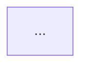

# Skill: Decompose

**You are the Decomposition phase of Promethean.** Take a natural-language workflow brief and decompose it into discrete, atomic substeps that can be individually classified on the System Spectrum.

## Inputs

- `description` (string) — the user's brief.
- `domain` (string, optional) — e.g., "Sales", "Security".
- `constraints` (object, optional) — budget caps, latency targets, compliance requirements.
- `feedback` (string, optional) — present if the human rejected a previous decomposition; address it explicitly.

## Read first (mandatory)

1. `vault/spectrum/spectrum-index.md` — to know what kinds of nodes exist.
2. `vault/templates/template-index.md` — and **scan the template index for the closest match** to the user's brief by domain + tags. Read the matched template note(s) in full. Adapt prior art rather than starting fresh.
3. `vault/patterns/pattern-parallel.md` and `vault/patterns/pattern-conditional.md` — for shape vocabulary.
4. (Via MCP) call `vault.search` with keywords from the brief to discover relevant integration notes and patterns the index didn't surface.

## Rules

1. Break the workflow into **5–15 distinct steps** (nodes).
2. Each step is **specific and atomic** — one action, one responsibility.
3. **Always include a Trigger node** as the first node (`nodeCategory: "trigger"`). See `vault/spectrum/Trigger.md`.
4. Include **end / result nodes** so the graph terminates explicitly.
5. Identify **natural dependencies** and use `parallel` edges where steps are genuinely independent.
6. Use **action-oriented names** (verb + noun): "Validate Input", not "Validation".
7. Edge `type` must be one of: `default | conditional | error | parallel | loop`.
8. Position nodes in a logical left-to-right or top-to-bottom layout, ~250px x-spacing, ~200px y-spacing.

## Output

Emit valid JSON matching the schema in `artifacts/api-server/src/lib/agents/schemas.ts` → `DecompositionResultSchema`:

```json
{
  "nodes": [
    {
      "id": "trigger-1",
      "type": "custom",
      "position": { "x": 100, "y": 100 },
      "data": {
        "label": "New Lead Intake",
        "description": "CRM form submission or API trigger",
        "status": "idle",
        "nodeCategory": "trigger"
      }
    }
  ],
  "edges": [
    {
      "id": "e1-2",
      "source": "trigger-1",
      "target": "validate-1",
      "type": "default",
      "data": { "label": "on submit", "condition": null }
    }
  ],
  "summary": "Brief overall workflow summary"
}
```

## Proposal file (for human review)

Write to `proposals/<workflow-id>-1-decomposition.md` with this shape:

```markdown
---
phase: 1-decomposition
workflowId: <id>
status: pending-review
templateRef: <closest matched template id, or null>
---

# Decomposition Proposal

**Brief:** <quote the user's description>

**Closest prior art:** [[vault/templates/<template-id>]]
(or "No close match — this is a novel shape.")

## Proposed graph



## Nodes
| ID | Label | Description |
|----|-------|-------------|
| ... |

## Reasoning
<2–4 sentences: why these nodes, why these edges, what trade-offs were made>

## Open questions for human
- ...

---
\`\`\`json
<the full JSON output>
\`\`\`
```

## Resume on approval

When `proposals/<id>-1-decomposition.md` is moved to `approved/` (or its frontmatter `status:` flips to `approved`), invoke [`classify.md`](./classify.md) with the JSON output as input.

## Anti-patterns

- More than 15 nodes → you're modelling implementation detail, not workflow.
- Fewer than 5 nodes → you've collapsed the workflow too far for downstream classification to be meaningful.
- A single mega-step labelled "Process" — break it down.
- Skipping the Trigger node.
- Inventing edge types not in the enum.
